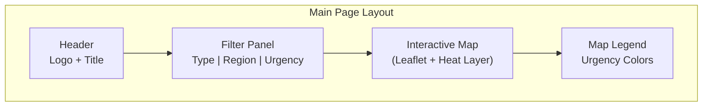
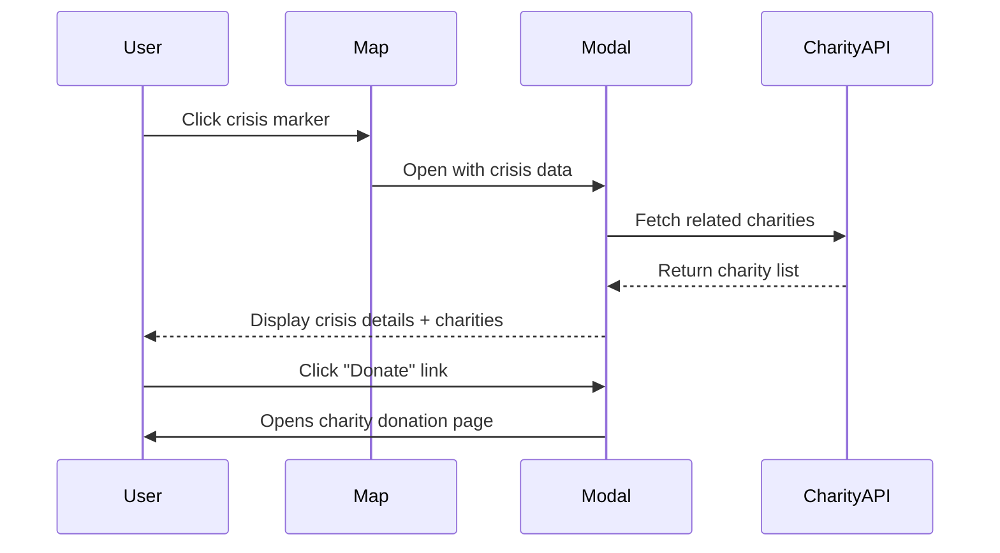

# AGENTS.md - CrisisTarget Project

## Project Overview

**What:** A browser-based interactive world map that visualizes humanitarian crises with heat mapping, showing urgency levels and linking users to relevant charitable organizations for each crisis.

**Why:** To increase awareness of global humanitarian needs and make it easy for the general public and donors to find and support verified charitable organizations targeting specific crises.

**Users:** General public and donors looking to understand global crises and contribute to relief efforts.

---

## Tech Stack

- **Language:** HTML5, CSS3, JavaScript (ES6+)
- **Framework:** Vanilla JS (no framework)
- **Map Library:** Leaflet.js (open-source, free)
- **APIs:**
  - ReliefWeb API (crisis data)
  - GDACS API (natural disasters)
  - Charity Navigator API (charity ratings & info)
- **Build:** None required (static files)
- **Hosting:** GitHub Pages (recommended - free, easy deployment)

---

## Project Structure

```
/CrisisMap
  /css
    styles.css           - Main stylesheet
    map.css              - Map-specific styles
    modal.css            - Modal popup styles
    filters.css          - Filter panel styles
  /js
    app.js               - Entry point, initialization
    map.js               - Leaflet map setup and heat layer
    crisisData.js        - Crisis API integration
    charityData.js       - Charity Navigator API integration
    modal.js             - Modal popup management
    filters.js           - Filter logic and UI
    utils.js             - Utility functions
  /data
    fallback-crises.json - Fallback data if APIs unavailable
    regions.json         - Region definitions
  /assets
    /icons               - Crisis type icons
    /images              - Logo, placeholders
  index.html             - Main application page
  AGENTS.md
  README.md
```

---

## Data Models

### Crisis Object

```javascript
const crisis = {
  id: 'crisis-001',
  name: 'Syria Humanitarian Crisis',
  type: 'conflict',              // 'conflict', 'natural_disaster', 'famine', 'disease', 'refugee'
  region: 'middle_east',         // Region identifier
  country: 'Syria',
  countryCode: 'SY',
  coordinates: {
    lat: 35.0,
    lng: 38.0
  },
  urgencyLevel: 5,               // 1-5 scale (5 = most urgent)
  description: 'Ongoing civil conflict...',
  affectedPopulation: 13400000,
  startDate: '2011-03-15',
  lastUpdated: '2024-12-17',
  sources: ['ReliefWeb', 'UNHCR'],
  relatedCharities: ['charity-001', 'charity-002']
};
```

### Charity Object

```javascript
const charity = {
  id: 'charity-001',
  name: 'Doctors Without Borders',
  ein: '13-3433452',
  rating: 4,                     // Charity Navigator rating (0-4 stars)
  score: 96.75,                  // Overall score
  category: 'International Relief',
  crisisTypes: ['conflict', 'disease', 'refugee'],
  regions: ['global'],
  donateUrl: 'https://donate.msf.org',
  websiteUrl: 'https://www.msf.org',
  logoUrl: '/assets/icons/msf-logo.png',
  description: 'Medical humanitarian organization...',
  financialRating: 4,
  accountabilityRating: 4
};
```

### Urgency Levels

```javascript
const URGENCY_LEVELS = {
  1: { label: 'Monitoring', color: '#FFEB3B', description: 'Situation being monitored' },
  2: { label: 'Elevated', color: '#FFC107', description: 'Elevated concern' },
  3: { label: 'High', color: '#FF9800', description: 'Significant humanitarian need' },
  4: { label: 'Severe', color: '#FF5722', description: 'Severe humanitarian emergency' },
  5: { label: 'Critical', color: '#F44336', description: 'Critical emergency - immediate action needed' }
};
```

### Crisis Types

```javascript
const CRISIS_TYPES = {
  conflict: { label: 'Armed Conflict', icon: '⚔️', color: '#E53935' },
  natural_disaster: { label: 'Natural Disaster', icon: '🌪️', color: '#FF9800' },
  famine: { label: 'Famine/Food Crisis', icon: '🍽️', color: '#795548' },
  disease: { label: 'Disease Outbreak', icon: '🦠', color: '#9C27B0' },
  refugee: { label: 'Refugee Crisis', icon: '🏃', color: '#2196F3' }
};
```

### Regions

```javascript
const REGIONS = {
  africa: { label: 'Africa', bounds: [[-35, -20], [37, 55]] },
  asia: { label: 'Asia', bounds: [[-10, 25], [55, 180]] },
  europe: { label: 'Europe', bounds: [[35, -25], [72, 65]] },
  middle_east: { label: 'Middle East', bounds: [[12, 25], [45, 65]] },
  americas: { label: 'Americas', bounds: [[-55, -170], [70, -30]] },
  oceania: { label: 'Oceania', bounds: [[-50, 110], [0, 180]] }
};
```

---

## API Integration

### ReliefWeb API (Crisis Data)

```javascript
// Base URL
const RELIEFWEB_API = 'https://api.reliefweb.int/v1';

// Endpoints used
// GET /reports - Crisis reports
// GET /disasters - Disaster listings
// GET /countries - Country information

// Example query
async function fetchCrises() {
  const response = await fetch(`${RELIEFWEB_API}/disasters?appname=crisis-map&limit=100&filter[field]=status&filter[value]=ongoing`);
  return response.json();
}
```

### GDACS API (Natural Disasters)

```javascript
// Base URL
const GDACS_API = 'https://www.gdacs.org/gdacsapi/api/events/geteventlist';

// Returns GeoJSON of current disasters
// Types: EQ (earthquake), TC (tropical cyclone), FL (flood), VO (volcano), DR (drought)
```

### Charity Navigator API

```javascript
// Base URL (requires API key)
const CHARITY_NAV_API = 'https://api.charitynavigator.org/v2';

// Endpoints
// GET /Organizations - Search charities
// GET /Organizations/{ein} - Get charity details

// Headers required
const headers = {
  'Subscription-Key': 'YOUR_API_KEY'
};
```

### API Error Handling

```javascript
// Fallback pattern
async function getCrisisData() {
  try {
    const apiData = await fetchFromReliefWeb();
    return transformApiData(apiData);
  } catch (error) {
    console.warn('API failed, using fallback data:', error);
    return loadFallbackData();
  }
}
```

---

## Map Configuration

### Leaflet Setup

```javascript
// Initialize map
const map = L.map('crisis-map', {
  center: [20, 0],
  zoom: 2,
  minZoom: 2,
  maxZoom: 10,
  worldCopyJump: true
});

// Tile layer (OpenStreetMap)
L.tileLayer('https://{s}.tile.openstreetmap.org/{z}/{x}/{y}.png', {
  attribution: '© OpenStreetMap contributors'
}).addTo(map);
```

### Heat Map Layer

```javascript
// Using Leaflet.heat plugin
const heatData = crises.map(c => [
  c.coordinates.lat,
  c.coordinates.lng,
  c.urgencyLevel / 5  // Normalize to 0-1
]);

const heatLayer = L.heatLayer(heatData, {
  radius: 25,
  blur: 15,
  maxZoom: 10,
  gradient: {
    0.2: '#FFEB3B',
    0.4: '#FFC107',
    0.6: '#FF9800',
    0.8: '#FF5722',
    1.0: '#F44336'
  }
}).addTo(map);
```

### Crisis Markers

```javascript
// Create marker for each crisis
function createCrisisMarker(crisis) {
  const icon = L.divIcon({
    className: 'crisis-marker',
    html: `<span class="crisis-icon crisis-${crisis.type}">${CRISIS_TYPES[crisis.type].icon}</span>`,
    iconSize: [30, 30]
  });
  
  const marker = L.marker([crisis.coordinates.lat, crisis.coordinates.lng], { icon });
  marker.on('click', () => showCrisisModal(crisis));
  return marker;
}
```

---

## User Interface

### Main Layout



### Modal Popup Flow



### Filter Panel

```
┌─────────────────────────────────────────────────────┐
│ FILTERS                                    [Reset]  │
├─────────────────────────────────────────────────────┤
│ Crisis Type:  [All ▼]                               │
│   ☑ Armed Conflict  ☑ Natural Disaster              │
│   ☑ Famine          ☑ Disease Outbreak              │
│   ☑ Refugee Crisis                                  │
├─────────────────────────────────────────────────────┤
│ Region:       [All ▼]                               │
│   ☑ Africa    ☑ Asia    ☑ Europe                    │
│   ☑ Middle East  ☑ Americas  ☑ Oceania              │
├─────────────────────────────────────────────────────┤
│ Urgency:      ●───────────○ 1 to 5                  │
│               Min         Max                       │
└─────────────────────────────────────────────────────┘
```

### Crisis Modal Content

```
┌─────────────────────────────────────────────────────────┐
│ ⚔️ SYRIA HUMANITARIAN CRISIS                       [X] │
├─────────────────────────────────────────────────────────┤
│ Urgency: ████████░░ SEVERE (4/5)                        │
│ Region: Middle East | Country: Syria                    │
│ Affected: 13.4 million people                           │
│ Started: March 2011                                     │
│                                                         │
│ Description:                                            │
│ Ongoing armed conflict has displaced millions...        │
│                                                         │
├─────────────────────────────────────────────────────────┤
│ SUPPORT THESE ORGANIZATIONS:                            │
│ ┌─────────────────────────────────────────────────────┐ │
│ │ ⭐⭐⭐⭐ Doctors Without Borders                      │ │
│ │ Rating: 96.75/100 | International Relief            │ │
│ │ [Visit Website]  [DONATE →]                         │ │
│ └─────────────────────────────────────────────────────┘ │
│ ┌─────────────────────────────────────────────────────┐ │
│ │ ⭐⭐⭐⭐ UNHCR                                        │ │
│ │ Rating: 94.20/100 | Refugee Relief                  │ │
│ │ [Visit Website]  [DONATE →]                         │ │
│ └─────────────────────────────────────────────────────┘ │
└─────────────────────────────────────────────────────────┘
```

---

## Coding Conventions

### JavaScript Style
- Use ES6+ features (const/let, arrow functions, async/await, template literals)
- Use strict mode (`'use strict';`)
- Prefer `const` over `let`, avoid `var`
- Use meaningful function and variable names
- Handle all API errors gracefully

### Code Organization
- One module per file (map, data, modal, filters separate)
- Use IIFE pattern for module encapsulation
- Keep functions small and single-purpose
- Comment complex logic and API integrations

### HTML/CSS Guidelines
- Use semantic HTML elements
- Use CSS custom properties for theming
- Mobile-first responsive design
- Use BEM naming for CSS classes

### Documentation Standards
- **Diagrams:** Use Mermaid diagrams ONLY (no ASCII art)
- Supported diagram types: flowchart, sequence, class, state, ER, gantt, pie, xychart
- All diagrams must be in ```mermaid code blocks

---

## Naming Conventions

| Type | Convention | Example |
|------|------------|---------|
| Functions | camelCase, verb-first | `fetchCrises()`, `showModal()` |
| Variables | camelCase | `currentFilters`, `crisisData` |
| Constants | UPPER_SNAKE_CASE | `API_BASE_URL`, `URGENCY_LEVELS` |
| CSS Classes | kebab-case with BEM | `.crisis-card`, `.modal__header` |
| Files | lowercase with hyphens | `crisis-data.js`, `map-config.js` |
| Data IDs | kebab-case with prefix | `crisis-001`, `charity-msf` |

---

## Error Handling

### API Failures
```javascript
// Graceful degradation pattern
async function loadCrisisData() {
  const sources = [
    () => fetchReliefWebData(),
    () => fetchGDACSData(),
    () => loadFallbackJSON()
  ];
  
  for (const source of sources) {
    try {
      const data = await source();
      if (data && data.length > 0) return data;
    } catch (e) {
      console.warn('Data source failed:', e.message);
    }
  }
  
  showErrorMessage('Unable to load crisis data. Please try again later.');
  return [];
}
```

### User Feedback
- Show loading spinner during API calls
- Display user-friendly error messages
- Provide "Retry" option on failures
- Never show raw error messages to users

---

## Performance Guidelines

### Map Performance
- Cluster markers when zoomed out (Leaflet.markercluster)
- Lazy load charity data (fetch on modal open, not page load)
- Debounce filter changes (300ms)
- Cache API responses (5-minute TTL)

### Asset Loading
- Lazy load images in modals
- Use SVG icons for crisis types
- Minimize external dependencies

---

## Security Considerations

### API Keys
- Store Charity Navigator API key in environment variable
- Never commit API keys to repository
- Use proxy endpoint for production (hide key server-side)

### External Links
- All donate links open in new tab with `rel="noopener noreferrer"`
- Validate URLs before rendering
- Only link to verified charity websites

---

## Testing Strategy

### Test Approach
Use browser console tests with assertions. Test files in `/tests` folder.

### Key Test Cases

**Map Tests:**
- Map initializes with correct center and zoom
- Heat layer renders with crisis data
- Markers appear at correct coordinates
- Click on marker opens modal

**Data Tests:**
- API response transforms correctly to crisis objects
- Fallback data loads when API fails
- Invalid data is filtered out
- Coordinates are validated

**Filter Tests:**
- Filters update map markers correctly
- Multiple filters combine with AND logic
- Reset clears all filters
- URL params reflect filter state

**Modal Tests:**
- Modal opens with correct crisis data
- Charities load and display
- Donate links have correct URLs
- Close button dismisses modal

---

## Deployment (GitHub Pages)

### Setup
1. Create GitHub repository
2. Enable GitHub Pages in Settings → Pages
3. Set source to `main` branch, `/root` folder
4. Site available at `https://username.github.io/crisis-map`

### Environment Variables
For API keys, use a build step or serverless function:
```javascript
// For development - use .env file (not committed)
// For production - use GitHub Secrets + Actions
```

### Recommended GitHub Action
```yaml
name: Deploy to GitHub Pages
on:
  push:
    branches: [main]
jobs:
  deploy:
    runs-on: ubuntu-latest
    steps:
      - uses: actions/checkout@v3
      - name: Deploy
        uses: peaceiris/actions-gh-pages@v3
        with:
          github_token: ${{ secrets.GITHUB_TOKEN }}
          publish_dir: ./
```

---

## Instructions for AI Agents

When working in this codebase:

1. **Read AGENTS.md first** to understand data models and API structure

2. **Keep modules separate** - Map logic, data fetching, and UI are independent

3. **Handle API failures** - Always implement fallback behavior

4. **Test with mock data** - Use fallback JSON for development

5. **Respect rate limits** - Cache API responses, don't over-fetch

6. **Validate external data** - Never trust API responses blindly

7. **Secure external links** - Always use `rel="noopener noreferrer"`

8. **Mobile-first** - Test on small screens, ensure touch-friendly UI

9. **User-focused** - Prioritize clarity over complexity for donors

10. **Use Mermaid** - All documentation diagrams must use Mermaid syntax

---

## Implementation Checklist

### Phase 1: Foundation
- [ ] Create folder structure
- [ ] Set up basic HTML layout
- [ ] Initialize Leaflet map with tile layer
- [ ] Create CSS variables and base styles

### Phase 2: Data Layer
- [ ] Implement ReliefWeb API integration
- [ ] Implement GDACS API integration
- [ ] Create data transformation functions
- [ ] Build fallback JSON data file
- [ ] Add caching layer

### Phase 3: Map Features
- [ ] Add heat map layer
- [ ] Create crisis markers with icons
- [ ] Implement marker clustering
- [ ] Add map legend

### Phase 4: Interactivity
- [ ] Build modal component
- [ ] Implement Charity Navigator API
- [ ] Create charity cards with donate links
- [ ] Add loading states

### Phase 5: Filtering
- [ ] Build filter panel UI
- [ ] Implement crisis type filter
- [ ] Implement region filter
- [ ] Implement urgency slider
- [ ] Add filter reset functionality

### Phase 6: Polish
- [ ] Add responsive design
- [ ] Implement error handling UI
- [ ] Optimize performance
- [ ] Test cross-browser
- [ ] Deploy to GitHub Pages

---

## Resources

- [Leaflet Documentation](https://leafletjs.com/reference.html)
- [Leaflet.heat Plugin](https://github.com/Leaflet/Leaflet.heat)
- [ReliefWeb API Docs](https://apidoc.reliefweb.int/)
- [GDACS API](https://www.gdacs.org/gdacsapi/)
- [Charity Navigator API](https://www.charitynavigator.org/index.cfm?bay=content.view&cpid=1397)
