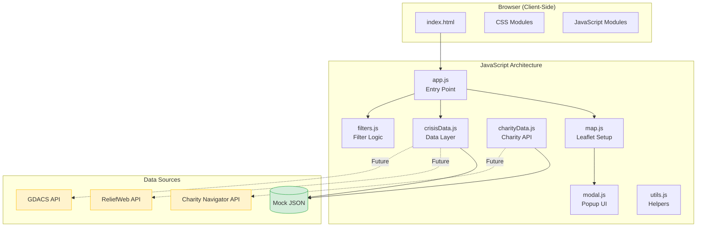
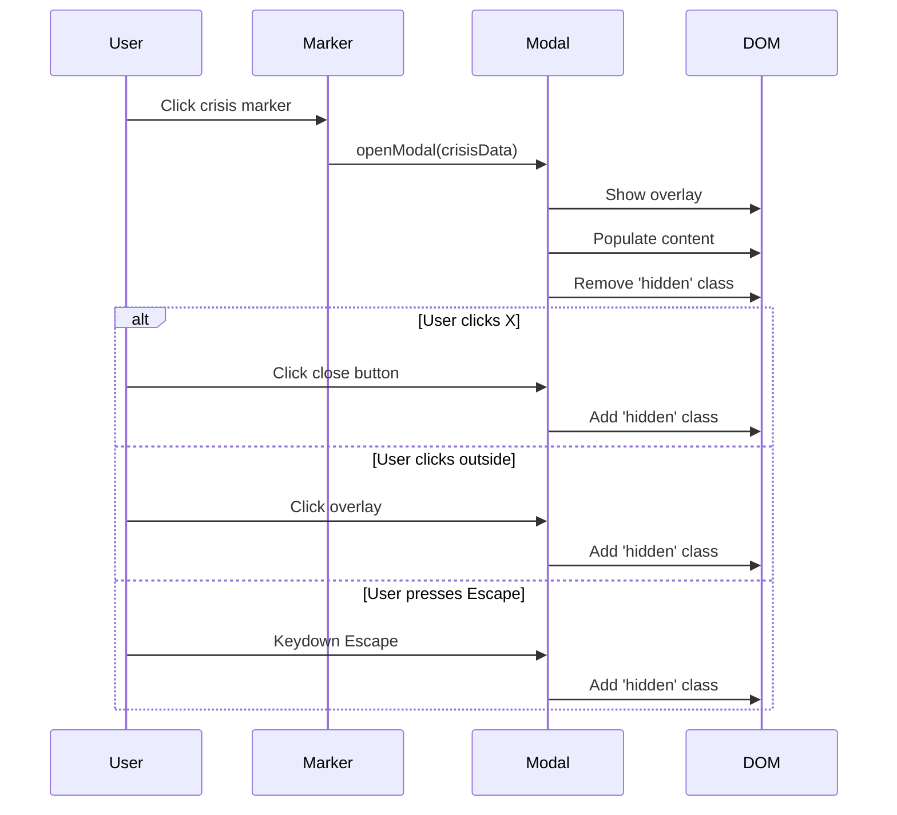
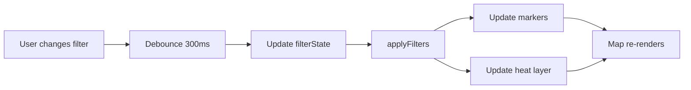

# Implementation Plan: CrisisTarget

## Overview

This document outlines the phased implementation approach for the Crisis Map application. The plan prioritizes quality over speed, with a working MVP (map with crises) as the first milestone.

**Development Approach:** AI-assisted development  
**Environment:** Open HTML files directly in browser  
**API Strategy:** Mock data first, real APIs integrated when keys available

---

## Architecture Overview



---

## Phase Summary

| Phase | Name | Focus | Deliverable |
|-------|------|-------|-------------|
| 1 | Foundation | Project setup, basic HTML/CSS | Styled page with empty map container |
| 2 | Map Core | Leaflet integration | Interactive world map with tiles |
| 3 | Mock Data | Crisis & charity JSON | Data layer with mock crises |
| 4 | Markers & Heat | Visualize crises | Markers and heat layer on map |
| 5 | Modal System | Crisis details popup | Clickable markers with modal |
| 6 | Charity Display | Charity cards | Charities in modal with donate links |
| 7 | Filtering | Filter UI & logic | Working filters for type/region/urgency |
| 8 | API Integration | Real data sources | ReliefWeb + GDACS integration |
| 9 | Polish | UX improvements | Loading states, errors, mobile |
| 10 | Deploy | GitHub Pages | Live public site |

---

## Phase 1: Foundation

### Objectives
- Set up project folder structure
- Create base HTML with semantic structure
- Establish CSS architecture with variables
- Create responsive layout shell

### Tasks

| Task | File(s) | Description |
|------|---------|-------------|
| 1.1 | `/` | Create folder structure per AGENTS.md |
| 1.2 | `index.html` | HTML boilerplate with header, map container, filter sidebar |
| 1.3 | `css/styles.css` | CSS reset, variables, typography |
| 1.4 | `css/map.css` | Map container styles, responsive sizing |
| 1.5 | `css/filters.css` | Filter panel layout (empty for now) |
| 1.6 | `css/modal.css` | Modal base styles (hidden by default) |

### Folder Structure

```
/CrisisMap
  /css
    styles.css
    map.css
    modal.css
    filters.css
  /js
    (empty - Phase 2+)
  /data
    (empty - Phase 3)
  /assets
    /icons
    /images
  index.html
  AGENTS.md
  PRODUCT-REQUIREMENTS.md
  IMPLEMENTATION-PLAN.md
  README.md
```

### HTML Structure

```html
<!DOCTYPE html>
<html lang="en">
<head>
  <meta charset="UTF-8">
  <meta name="viewport" content="width=device-width, initial-scale=1.0">
  <title>Crisis Map - Global Humanitarian Crises</title>
  <!-- CSS -->
</head>
<body>
  <header class="header">
    <h1>Crisis Map</h1>
    <button id="refresh-btn">Refresh Data</button>
  </header>
  
  <main class="main">
    <aside id="filter-panel" class="filter-panel">
      <!-- Filters go here -->
    </aside>
    
    <div id="map-container" class="map-container">
      <div id="crisis-map"></div>
      <div id="map-legend" class="map-legend"></div>
    </div>
  </main>
  
  <div id="crisis-modal" class="modal hidden">
    <!-- Modal content -->
  </div>
  
  <div id="loading-overlay" class="loading hidden">
    <span>Loading crisis data...</span>
  </div>
  
  <!-- JavaScript -->
</body>
</html>
```

### CSS Variables

```css
:root {
  /* Urgency Colors */
  --urgency-1: #FFEB3B;
  --urgency-2: #FFC107;
  --urgency-3: #FF9800;
  --urgency-4: #FF5722;
  --urgency-5: #F44336;
  
  /* Crisis Type Colors */
  --crisis-conflict: #E53935;
  --crisis-disaster: #FF9800;
  --crisis-famine: #795548;
  --crisis-disease: #9C27B0;
  --crisis-refugee: #2196F3;
  
  /* UI Colors */
  --bg-primary: #1a1a2e;
  --bg-secondary: #16213e;
  --text-primary: #ffffff;
  --text-secondary: #a0a0a0;
  --accent: #4a90d9;
  
  /* Spacing */
  --spacing-sm: 0.5rem;
  --spacing-md: 1rem;
  --spacing-lg: 1.5rem;
  --spacing-xl: 2rem;
  
  /* Sizing */
  --header-height: 60px;
  --filter-width: 280px;
  --modal-max-width: 600px;
}
```

### Exit Criteria
- [ ] All folders created
- [ ] HTML loads without errors
- [ ] Page shows header, empty map area, filter sidebar placeholder
- [ ] Responsive on mobile (filter panel collapses)

---

## Phase 2: Map Core

### Objectives
- Integrate Leaflet.js library
- Display world map with OpenStreetMap tiles
- Implement zoom and pan controls
- Add map legend placeholder

### Tasks

| Task | File(s) | Description |
|------|---------|-------------|
| 2.1 | `index.html` | Add Leaflet CSS/JS from CDN |
| 2.2 | `js/map.js` | Initialize Leaflet map |
| 2.3 | `js/app.js` | Entry point, call map init |
| 2.4 | `css/map.css` | Style map container full height |
| 2.5 | - | Add map legend HTML structure |

### Leaflet CDN

```html
<!-- In <head> -->
<link rel="stylesheet" href="https://unpkg.com/leaflet@1.9.4/dist/leaflet.css" />

<!-- Before </body> -->
<script src="https://unpkg.com/leaflet@1.9.4/dist/leaflet.js"></script>
<script src="https://unpkg.com/leaflet.heat@0.2.0/dist/leaflet-heat.js"></script>
```

### Map Initialization

```javascript
// js/map.js
'use strict';

var CrisisMap = (function() {
  var map;
  
  function init() {
    map = L.map('crisis-map', {
      center: [20, 0],
      zoom: 2,
      minZoom: 2,
      maxZoom: 10,
      worldCopyJump: true
    });
    
    L.tileLayer('https://{s}.tile.openstreetmap.org/{z}/{x}/{y}.png', {
      attribution: '© OpenStreetMap contributors'
    }).addTo(map);
    
    return map;
  }
  
  function getMap() {
    return map;
  }
  
  return {
    init: init,
    getMap: getMap
  };
})();
```

### Exit Criteria
- [ ] Leaflet loads without errors
- [ ] World map displays with tiles
- [ ] Zoom in/out works
- [ ] Pan/drag works
- [ ] Map is responsive

---

## Phase 3: Mock Data

### Objectives
- Create mock crisis JSON data (20-30 crises)
- Create mock charity JSON data (15-20 charities)
- Build data loading module
- Map crisis-charity relationships

### Tasks

| Task | File(s) | Description |
|------|---------|-------------|
| 3.1 | `data/crises.json` | Mock crisis data covering all types/regions |
| 3.2 | `data/charities.json` | Mock charity data with ratings |
| 3.3 | `js/crisisData.js` | Module to load and transform crisis data |
| 3.4 | `js/charityData.js` | Module to load charity data |
| 3.5 | `js/utils.js` | Helper functions |

### Mock Crisis Data Example

```json
{
  "crises": [
    {
      "id": "crisis-001",
      "name": "Syria Humanitarian Crisis",
      "type": "conflict",
      "region": "middle_east",
      "country": "Syria",
      "countryCode": "SY",
      "coordinates": { "lat": 35.0, "lng": 38.0 },
      "urgencyLevel": 5,
      "description": "Over a decade of conflict has created one of the worst humanitarian crises...",
      "affectedPopulation": 13400000,
      "startDate": "2011-03-15",
      "lastUpdated": "2024-12-17",
      "relatedCharities": ["charity-001", "charity-003", "charity-007"]
    }
  ]
}
```

### Mock Charity Data Example

```json
{
  "charities": [
    {
      "id": "charity-001",
      "name": "Doctors Without Borders",
      "rating": 4,
      "score": 96.75,
      "category": "International Relief",
      "crisisTypes": ["conflict", "disease", "refugee"],
      "donateUrl": "https://donate.doctorswithoutborders.org",
      "websiteUrl": "https://www.msf.org",
      "description": "Medical humanitarian organization providing emergency aid..."
    }
  ]
}
```

### Data Coverage Requirements

| Region | Min Crises | Types Covered |
|--------|------------|---------------|
| Africa | 5 | All 5 types |
| Middle East | 5 | Conflict, Refugee |
| Asia | 5 | Disaster, Disease, Famine |
| Americas | 3 | Disaster, Refugee |
| Europe | 2 | Refugee, Conflict |
| Oceania | 2 | Disaster |

### Exit Criteria
- [ ] crises.json has 20+ realistic crises
- [ ] charities.json has 15+ charities (all 3+ stars)
- [ ] Each crisis has 2-5 related charities
- [ ] Data loads via JS fetch
- [ ] Console shows loaded data

---

## Phase 4: Markers & Heat Layer

### Objectives
- Display crisis markers on map
- Add heat layer showing urgency density
- Create custom marker icons for crisis types
- Implement marker clustering (optional for v1)

### Tasks

| Task | File(s) | Description |
|------|---------|-------------|
| 4.1 | `js/map.js` | Add function to create markers |
| 4.2 | `js/map.js` | Add heat layer with urgency weighting |
| 4.3 | `css/map.css` | Style custom marker icons |
| 4.4 | `js/app.js` | Connect data loading to map rendering |
| 4.5 | - | Populate map legend |

### Heat Layer Configuration

```javascript
function addHeatLayer(crises) {
  var heatData = crises.map(function(c) {
    return [
      c.coordinates.lat,
      c.coordinates.lng,
      c.urgencyLevel / 5  // Normalize 0-1
    ];
  });
  
  var heatLayer = L.heatLayer(heatData, {
    radius: 35,
    blur: 20,
    maxZoom: 8,
    gradient: {
      0.2: '#FFEB3B',
      0.4: '#FFC107',
      0.6: '#FF9800',
      0.8: '#FF5722',
      1.0: '#F44336'
    }
  });
  
  heatLayer.addTo(map);
  return heatLayer;
}
```

### Custom Marker Icons

```javascript
function createCrisisMarker(crisis) {
  var iconHtml = '<span class="crisis-marker crisis-' + crisis.type + '">' +
                 CRISIS_ICONS[crisis.type] + '</span>';
  
  var icon = L.divIcon({
    className: 'crisis-marker-container',
    html: iconHtml,
    iconSize: [36, 36],
    iconAnchor: [18, 18]
  });
  
  return L.marker([crisis.coordinates.lat, crisis.coordinates.lng], { 
    icon: icon 
  });
}
```

### Exit Criteria
- [ ] Heat layer renders on map
- [ ] All crises show as markers
- [ ] Markers have type-specific icons
- [ ] Legend shows urgency color scale
- [ ] Map doesn't lag with all markers

---

## Phase 5: Modal System

### Objectives
- Create modal component for crisis details
- Wire marker clicks to open modal
- Display full crisis information
- Add close functionality (X button, click outside, Escape key)

### Tasks

| Task | File(s) | Description |
|------|---------|-------------|
| 5.1 | `js/modal.js` | Modal open/close functions |
| 5.2 | `js/modal.js` | Render crisis details in modal |
| 5.3 | `css/modal.css` | Full modal styling |
| 5.4 | `js/map.js` | Add click handlers to markers |
| 5.5 | `js/modal.js` | Keyboard (Escape) and click-outside close |

### Modal Component Flow



### Modal HTML Structure

```html
<div id="crisis-modal" class="modal hidden">
  <div class="modal__overlay"></div>
  <div class="modal__content">
    <button class="modal__close" aria-label="Close">&times;</button>
    
    <header class="modal__header">
      <span class="modal__icon"></span>
      <h2 class="modal__title"></h2>
    </header>
    
    <div class="modal__body">
      <div class="crisis-meta">
        <span class="crisis-urgency"></span>
        <span class="crisis-region"></span>
        <span class="crisis-affected"></span>
      </div>
      <p class="crisis-description"></p>
    </div>
    
    <div class="modal__charities">
      <h3>Support These Organizations</h3>
      <div id="charity-list" class="charity-list">
        <!-- Charity cards inserted here -->
      </div>
    </div>
  </div>
</div>
```

### Exit Criteria
- [ ] Clicking marker opens modal
- [ ] Modal shows crisis name, type, urgency
- [ ] Modal shows description and affected population
- [ ] Close button works
- [ ] Click outside closes modal
- [ ] Escape key closes modal
- [ ] Modal is scrollable if content is long

---

## Phase 6: Charity Display

### Objectives
- Load charity data for selected crisis
- Render charity cards in modal
- Add donate and website links
- Apply 3+ star filter

### Tasks

| Task | File(s) | Description |
|------|---------|-------------|
| 6.1 | `js/charityData.js` | Function to get charities by crisis |
| 6.2 | `js/charityData.js` | Filter by rating (3+ stars) |
| 6.3 | `js/modal.js` | Render charity cards |
| 6.4 | `css/modal.css` | Style charity cards |
| 6.5 | - | Ensure donate links have security attributes |

### Charity Card HTML

```html
<div class="charity-card">
  <div class="charity-card__header">
    <h4 class="charity-card__name">Doctors Without Borders</h4>
    <div class="charity-card__rating">
      <span class="stars">⭐⭐⭐⭐</span>
      <span class="score">96.75</span>
    </div>
  </div>
  <p class="charity-card__category">International Relief</p>
  <p class="charity-card__description">Medical humanitarian organization...</p>
  <div class="charity-card__actions">
    <a href="https://www.msf.org" target="_blank" rel="noopener noreferrer" 
       class="btn btn--secondary">Website</a>
    <a href="https://donate.msf.org" target="_blank" rel="noopener noreferrer" 
       class="btn btn--primary">Donate →</a>
  </div>
</div>
```

### Exit Criteria
- [ ] Charities load when modal opens
- [ ] Only 3+ star charities displayed
- [ ] Maximum 5 charities shown
- [ ] Donate links open in new tab
- [ ] Links have `rel="noopener noreferrer"`
- [ ] Cards are visually appealing

---

## Phase 7: Filtering

### Objectives
- Build filter panel UI
- Implement crisis type checkboxes
- Implement region dropdown/checkboxes
- Implement urgency range slider
- Wire filters to update map

### Tasks

| Task | File(s) | Description |
|------|---------|-------------|
| 7.1 | `index.html` | Filter panel HTML structure |
| 7.2 | `js/filters.js` | Filter state management |
| 7.3 | `js/filters.js` | Apply filters to crisis data |
| 7.4 | `js/map.js` | Update markers based on filters |
| 7.5 | `css/filters.css` | Style filter panel |
| 7.6 | `js/filters.js` | Reset filters function |
| 7.7 | - | Debounce filter changes (300ms) |

### Filter State

```javascript
var filterState = {
  types: ['conflict', 'natural_disaster', 'famine', 'disease', 'refugee'],
  regions: ['africa', 'asia', 'europe', 'middle_east', 'americas', 'oceania'],
  urgencyMin: 1,
  urgencyMax: 5
};

function applyFilters(crises) {
  return crises.filter(function(crisis) {
    var typeMatch = filterState.types.includes(crisis.type);
    var regionMatch = filterState.regions.includes(crisis.region);
    var urgencyMatch = crisis.urgencyLevel >= filterState.urgencyMin &&
                       crisis.urgencyLevel <= filterState.urgencyMax;
    return typeMatch && regionMatch && urgencyMatch;
  });
}
```

### Filter Panel Flow



### Exit Criteria
- [ ] All filter controls render
- [ ] Type checkboxes work
- [ ] Region selection works
- [ ] Urgency slider works
- [ ] Map updates when filters change
- [ ] Reset button clears all filters
- [ ] No lag when filtering

---

## Phase 8: API Integration

### Objectives
- Integrate ReliefWeb API (when ready)
- Integrate GDACS API (when ready)
- Integrate Charity Navigator API (when key available)
- Maintain fallback to mock data

### Tasks

| Task | File(s) | Description |
|------|---------|-------------|
| 8.1 | `js/crisisData.js` | ReliefWeb API fetch function |
| 8.2 | `js/crisisData.js` | GDACS API fetch function |
| 8.3 | `js/crisisData.js` | Transform API response to crisis model |
| 8.4 | `js/charityData.js` | Charity Navigator API integration |
| 8.5 | `js/config.js` | API configuration (keys placeholder) |
| 8.6 | - | Implement caching (5 min TTL) |

### API Configuration

```javascript
// js/config.js
var Config = {
  // Set to true when API keys are available
  USE_LIVE_APIS: false,
  
  // API Keys (replace with real keys)
  CHARITY_NAV_KEY: 'YOUR_KEY_HERE',
  
  // API Endpoints
  RELIEFWEB_API: 'https://api.reliefweb.int/v1',
  GDACS_API: 'https://www.gdacs.org/gdacsapi/api/events',
  CHARITY_NAV_API: 'https://api.charitynavigator.org/v2',
  
  // Cache duration (milliseconds)
  CACHE_TTL: 5 * 60 * 1000  // 5 minutes
};
```

### Fallback Pattern

```javascript
async function loadCrisisData() {
  if (Config.USE_LIVE_APIS) {
    try {
      var apiData = await fetchFromReliefWeb();
      cacheData('crises', apiData);
      return apiData;
    } catch (error) {
      console.warn('API failed, using fallback:', error);
    }
  }
  return loadMockData();
}
```

### Exit Criteria
- [ ] API functions created (even if not active)
- [ ] Config file has clear placeholders
- [ ] Toggle exists to switch mock ↔ live
- [ ] Fallback works if API fails
- [ ] Data transforms to correct model

---

## Phase 9: Polish

### Objectives
- Add loading states and spinners
- Implement error handling UI
- Improve mobile experience
- Add refresh functionality
- Cross-browser testing

### Tasks

| Task | File(s) | Description |
|------|---------|-------------|
| 9.1 | `js/app.js` | Loading overlay show/hide |
| 9.2 | `js/app.js` | Error message display |
| 9.3 | `css/styles.css` | Loading spinner animation |
| 9.4 | - | Mobile filter panel (collapsible) |
| 9.5 | - | Refresh button functionality |
| 9.6 | - | "Using cached data" indicator |
| 9.7 | - | Test on Chrome, Firefox, Safari, Edge |
| 9.8 | - | Test on iOS and Android |

### Loading States

```javascript
function showLoading(message) {
  var overlay = document.getElementById('loading-overlay');
  overlay.querySelector('span').textContent = message || 'Loading...';
  overlay.classList.remove('hidden');
}

function hideLoading() {
  document.getElementById('loading-overlay').classList.add('hidden');
}

function showError(message) {
  // Toast notification or banner
  var toast = document.createElement('div');
  toast.className = 'toast toast--error';
  toast.textContent = message;
  document.body.appendChild(toast);
  setTimeout(function() { toast.remove(); }, 5000);
}
```

### Exit Criteria
- [ ] Loading spinner shows during data fetch
- [ ] Error messages display gracefully
- [ ] Mobile layout works well
- [ ] Filter panel collapses on mobile
- [ ] Refresh button reloads data
- [ ] No console errors
- [ ] Works in all target browsers

---

## Phase 10: Deploy

### Objectives
- Prepare for production
- Deploy to GitHub Pages
- Create README documentation
- Final testing on live URL

### Tasks

| Task | File(s) | Description |
|------|---------|-------------|
| 10.1 | - | Create GitHub repository |
| 10.2 | `README.md` | User documentation |
| 10.3 | - | Enable GitHub Pages |
| 10.4 | - | Test live URL |
| 10.5 | - | Verify all features work |
| 10.6 | - | Share URL for feedback |

### README Content

```markdown
# Crisis Map

Interactive map visualizing global humanitarian crises and connecting donors with verified charities.

## Features
- 🗺️ Interactive world map with crisis heat mapping
- 🔍 Filter by crisis type, region, and urgency
- 💝 Verified charity recommendations (3+ star rated)
- 📱 Mobile-friendly design

## Usage
Visit: https://[username].github.io/crisis-map

## Data Sources
- ReliefWeb API
- GDACS (Global Disaster Alert)
- Charity Navigator

## Contributing
[Instructions]

## License
MIT
```

### Exit Criteria
- [ ] Site deployed to GitHub Pages
- [ ] Live URL works
- [ ] README is complete
- [ ] All features functional on live site
- [ ] No mixed content warnings
- [ ] Performance acceptable

---

## Testing Strategy

### Manual Test Cases

| ID | Test | Expected Result |
|----|------|-----------------|
| T01 | Load page | Map displays, data loads |
| T02 | Click crisis marker | Modal opens with details |
| T03 | Click donate link | Charity site opens in new tab |
| T04 | Close modal (X) | Modal closes |
| T05 | Close modal (Escape) | Modal closes |
| T06 | Close modal (click outside) | Modal closes |
| T07 | Filter by type | Only selected types show |
| T08 | Filter by region | Only selected region shows |
| T09 | Filter by urgency | Only matching urgency shows |
| T10 | Reset filters | All crises show |
| T11 | Refresh data | Data reloads |
| T12 | Mobile view | Responsive layout works |

### Browser Testing Matrix

| Browser | Version | Status |
|---------|---------|--------|
| Chrome | 90+ | ⬜ |
| Firefox | 88+ | ⬜ |
| Safari | 14+ | ⬜ |
| Edge | 90+ | ⬜ |
| iOS Safari | 14+ | ⬜ |
| Chrome Android | Latest | ⬜ |

---

## Risk Mitigation

| Risk | Impact | Mitigation |
|------|--------|------------|
| API unavailable | High | Mock data fallback always works |
| API rate limits | Medium | Caching + session-based refresh only |
| Charity API key delayed | Low | Mock charity data ready |
| Too many crises (perf) | Medium | Marker clustering if needed |
| Map tiles fail | Medium | Fallback tile provider |

---

## Definition of Done

A phase is complete when:
- [ ] All tasks in the phase are completed
- [ ] Exit criteria are met
- [ ] No JavaScript console errors
- [ ] Feature works on Chrome and Firefox (minimum)
- [ ] Code follows conventions in AGENTS.md

---

## Related Documents

- **AGENTS.md:** Technical conventions, data models
- **PRODUCT-REQUIREMENTS.md:** Full requirements and acceptance criteria
- **README.md:** User-facing documentation (Phase 10)
